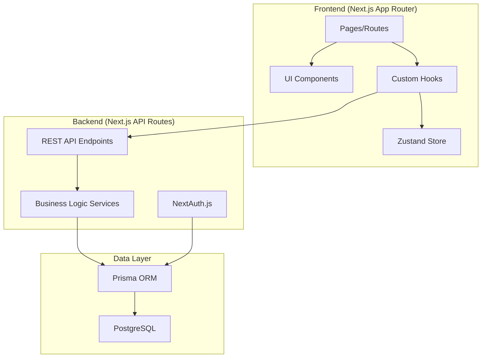

# Modernisasi Aplikasi Kredit Konsumer BNI ke Fullstack Modern

## Ringkasan Analisis Aplikasi Existing

Aplikasi saat ini adalah **Flask (Python)** monolith dengan:
- **Backend**: Flask 3.0.0, SQLAlchemy, Flask-Migrate
- **Database**: SQLite dengan 1 tabel `Debitur`
- **Frontend**: Jinja2 templates + Bootstrap 5 + Vanilla JS
- **Fitur Utama**:
  - Input data debitur (Prapurna/Purna)
  - Kalkulasi DSR/RPC dengan validasi hard block 90%
  - Generate dokumen DOCX via `docxtpl`
  - Dark mode, filtering, CRUD operations

---

## Tech Stack Modern yang Direkomendasikan

### 🎨 Frontend

| Teknologi | Alasan |
|-----------|--------|
| **React 18** | Library UI paling populer dengan ekosistem terbesar |
| **Next.js 14** | Framework React #1 untuk production (SSR, API Routes, App Router) |
| **TypeScript** | Type safety, autocomplete, mengurangi bug |
| **TailwindCSS** | Utility-first CSS, sangat populer dan produktif |
| **Shadcn/UI** | Komponen UI modern, customizable, built on Radix UI |
| **React Hook Form** | Form handling paling efisien |
| **Zod** | Schema validation yang terintegrasi dengan TypeScript |
| **TanStack Query** | Data fetching & caching terbaik |
| **Zustand** | State management sederhana dan powerful |

### ⚙️ Backend

| Teknologi | Alasan |
|-----------|--------|
| **Next.js API Routes** | Unified fullstack dalam satu project |
| **Prisma ORM** | ORM paling modern dan type-safe untuk Node.js |
| **PostgreSQL** | Database relasional paling capable untuk production |
| **NextAuth.js** | Authentication standar untuk Next.js |
| **docx** | Library Node.js untuk generate DOCX |

### 🛠️ Development Tools

| Tool | Fungsi |
|------|--------|
| **pnpm** | Package manager tercepat |
| **ESLint + Prettier** | Code quality & formatting |
| **Husky** | Git hooks untuk pre-commit checks |
| **Vitest** | Unit testing |
| **Playwright** | E2E testing |

---

## Arsitektur Aplikasi Baru



---

## Proposed Changes

### 📁 Struktur Folder Baru

```
app_kredit_konsumer_bni/
├── src/
│   ├── app/                    # Next.js App Router
│   │   ├── (auth)/            # Route group untuk auth
│   │   │   ├── login/
│   │   │   └── register/
│   │   ├── (dashboard)/       # Route group untuk dashboard
│   │   │   ├── layout.tsx
│   │   │   ├── page.tsx       # Dashboard home
│   │   │   ├── debitur/
│   │   │   │   ├── page.tsx   # Riwayat debitur
│   │   │   │   └── [id]/
│   │   │   │       └── page.tsx
│   │   │   ├── form/
│   │   │   │   ├── prapurna/
│   │   │   │   └── purna/
│   │   │   └── admin/
│   │   │       └── template/
│   │   ├── api/               # API Routes
│   │   │   ├── auth/
│   │   │   ├── debitur/
│   │   │   ├── calculate/
│   │   │   └── generate/
│   │   ├── layout.tsx
│   │   └── page.tsx
│   ├── components/
│   │   ├── ui/                # Shadcn components
│   │   ├── forms/             # Form components
│   │   └── layout/            # Layout components
│   ├── lib/
│   │   ├── prisma.ts          # Prisma client
│   │   ├── auth.ts            # Auth config
│   │   └── utils.ts           # Utilities
│   ├── services/
│   │   ├── debitur.service.ts
│   │   ├── calculation.service.ts
│   │   └── document.service.ts
│   ├── hooks/
│   ├── stores/
│   └── types/
├── prisma/
│   └── schema.prisma
├── public/
├── templates/                  # DOCX templates
├── package.json
├── tailwind.config.ts
├── tsconfig.json
└── next.config.js
```

---

### Backend: Database Schema (Prisma)

#### [NEW] [schema.prisma](file:///c:/Users/zulka/Documents/01.%20PROJECT/app_kredit_konsumer_bni/prisma/schema.prisma)

```prisma
generator client {
  provider = "prisma-client-js"
}

datasource db {
  provider = "postgresql"
  url      = env("DATABASE_URL")
}

model User {
  id        String   @id @default(cuid())
  email     String   @unique
  password  String
  name      String
  role      Role     @default(USER)
  createdAt DateTime @default(now())
  updatedAt DateTime @updatedAt
  debiturs  Debitur[]
}

enum Role {
  ADMIN
  USER
}

model Debitur {
  id           String   @id @default(cuid())
  namaPemohon  String
  noKtp        String
  kategori     Kategori
  jenisPengajuan JenisPengajuan @default(BARU)
  segmentasi   Segmentasi @default(TASPEN)
  dataLengkap  Json
  createdAt    DateTime @default(now())
  updatedAt    DateTime @updatedAt
  createdBy    User     @relation(fields: [userId], references: [id])
  userId       String
}

enum Kategori {
  PRAPURNA_REGULER
  PRAPURNA_TAKEOVER
  PURNA_REGULER
  PURNA_TAKEOVER
}

enum JenisPengajuan {
  BARU
  TOP_UP
  TOP_UP_SISA_GAJI
  TAKEOVER
}

enum Segmentasi {
  TASPEN
  ASABRI
}

model Template {
  id        String   @id @default(cuid())
  kategori  Kategori @unique
  filename  String
  updatedAt DateTime @updatedAt
}
```

---

### Backend: API Endpoints

#### [NEW] [route.ts](file:///c:/Users/zulka/Documents/01.%20PROJECT/app_kredit_konsumer_bni/src/app/api/debitur/route.ts)

| Endpoint | Method | Deskripsi |
|----------|--------|-----------|
| `/api/debitur` | GET | List semua debitur dengan filter |
| `/api/debitur` | POST | Create debitur baru |
| `/api/debitur/[id]` | GET | Get detail debitur |
| `/api/debitur/[id]` | PUT | Update debitur |
| `/api/debitur/[id]` | DELETE | Hapus debitur |
| `/api/calculate/pmt` | POST | Hitung angsuran (PMT) |
| `/api/calculate/dsr` | POST | Hitung DSR dengan validasi |
| `/api/generate/docx/[id]` | GET | Generate DOCX dari template |
| `/api/template` | GET/POST | Kelola template DOCX |

---

### Backend: Business Logic Services

#### [NEW] [calculation.service.ts](file:///c:/Users/zulka/Documents/01.%20PROJECT/app_kredit_konsumer_bni/src/services/calculation.service.ts)

Migrasi logika dari `utils.py`:
- `calculatePMT()` - Perhitungan angsuran
- `calculateDSR()` - Perhitungan Debt Service Ratio
- `validateDSR()` - Validasi batas 90%
- `formatCurrency()` - Format Rupiah
- `formatDateIndonesian()` - Format tanggal Indonesia

---

### Frontend: UI Components

#### [NEW] Shadcn/UI Components

Komponen yang akan di-setup:
- `Button`, `Input`, `Select`, `Textarea`
- `Card`, `Badge`, `Avatar`
- `Table`, `Pagination`
- `Dialog`, `Dropdown`, `Tabs`
- `Form` (dengan React Hook Form integration)
- `Toast` (untuk notifikasi)

---

### Frontend: Halaman Utama

#### [NEW] Dashboard Page

Menampilkan:
- Welcome card dengan info user
- Product category cards (Prapurna, Purna)
- Quick stats (total debitur, pending, dll)

#### [NEW] Form Input Page

Features:
- Multi-tab form (Tab A-E seperti existing)
- Real-time validation dengan Zod
- Live DSR calculation
- Preview sebelum submit
- Auto-save draft

#### [NEW] Riwayat Page

Features:
- Data table dengan TanStack Table
- Search & filter (nama, NIK, jenis, segmentasi)
- Pagination
- Actions (Download, Edit, Delete)

---

## User Review Required

> [!IMPORTANT]
> **Keputusan Tech Stack**: Apakah Anda setuju menggunakan **Next.js 14** sebagai framework fullstack (menggabungkan frontend dan backend dalam satu project)?
> 
> Alternatif lain:
> 1. **Separate Frontend/Backend**: React (Vite) + Express.js/Fastify
> 2. **Laravel + Inertia.js**: Jika ingin tetap PHP-based
> 3. **Vue.js + Nuxt**: Alternatif framework yang juga populer

> [!WARNING]
> **Database Migration**: Perlu migrasi data dari SQLite ke PostgreSQL. Data existing akan di-export dan di-import ke schema baru.

> [!CAUTION]
> **Breaking Changes**: Aplikasi baru akan memiliki URL structure dan API yang berbeda. Perlu koordinasi jika ada integrasi dengan sistem lain.

---

## Verification Plan

### Automated Tests

1. **Unit Tests (Vitest)**
   ```bash
   pnpm test
   ```
   - Test calculation functions (PMT, DSR)
   - Test form validation schemas
   - Test utility functions

2. **API Integration Tests (Vitest)**
   ```bash
   pnpm test:api
   ```
   - Test CRUD endpoints
   - Test authentication flow
   - Test calculation endpoints

3. **E2E Tests (Playwright)**
   ```bash
   pnpm test:e2e
   ```
   - Test full user flow: login → input form → save → download
   - Test filter & search functionality
   - Test admin template upload

### Manual Verification

1. **Kalkulasi DSR**
   - Input data dengan berbagai skenario
   - Verifikasi DSR calculation sesuai dengan aplikasi lama
   - Test hard block ketika DSR > 90%

2. **Generate DOCX**
   - Download dokumen untuk setiap kategori
   - Bandingkan hasil dengan dokumen dari aplikasi lama
   - Cek formatting tanggal dan nominal

3. **Responsive Design**
   - Test di berbagai ukuran layar (mobile, tablet, desktop)
   - Test dark mode toggle

---

## Timeline Estimasi

| Fase | Durasi | Deliverable |
|------|--------|-------------|
| Setup Project | 1-2 hari | Struktur folder, dependencies, Prisma schema |
| Backend API | 3-4 hari | Semua API endpoints + business logic |
| Frontend Pages | 5-7 hari | Semua halaman dengan full functionality |
| Testing & Polish | 2-3 hari | Tests, bug fixes, optimizations |
| **Total** | **11-16 hari** | Production-ready application |

---

## Langkah Selanjutnya

Setelah approval:
1. Setup project Next.js dengan TypeScript
2. Install dan configure TailwindCSS + Shadcn/UI
3. Setup Prisma dengan PostgreSQL
4. Implementasi authentication
5. Build API endpoints satu per satu
6. Build UI components dan pages
7. Testing & verification
