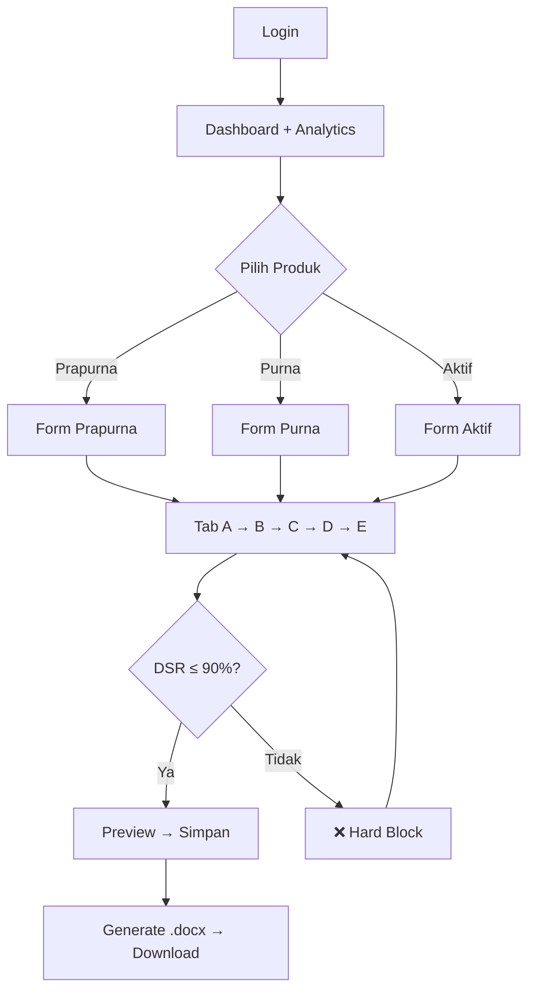
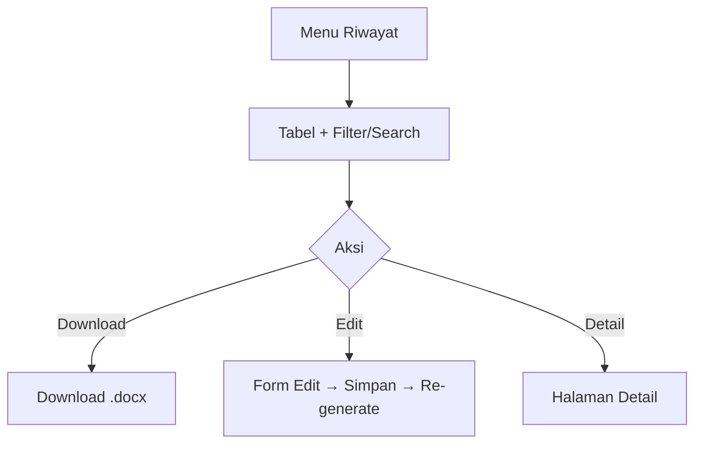
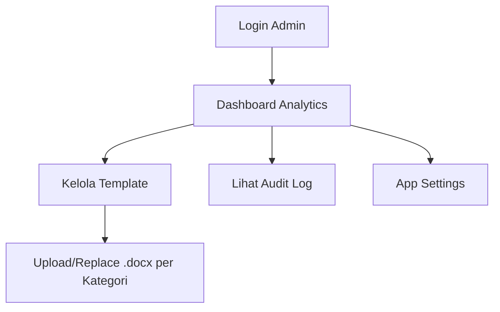
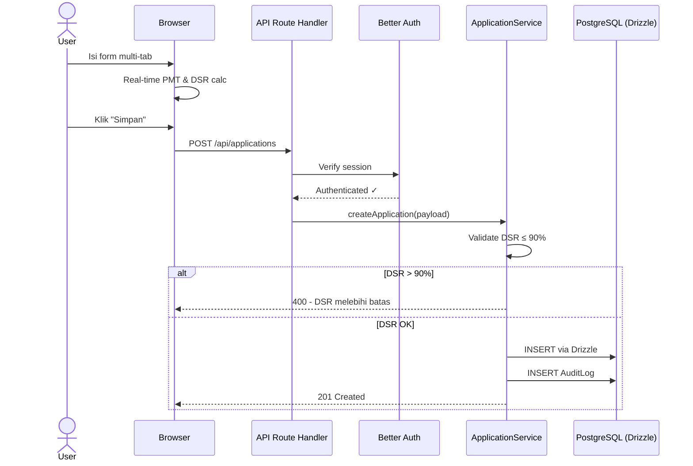
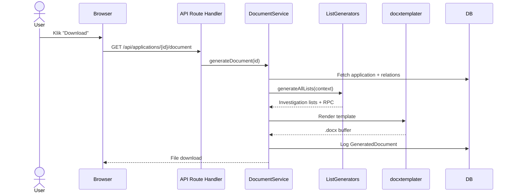
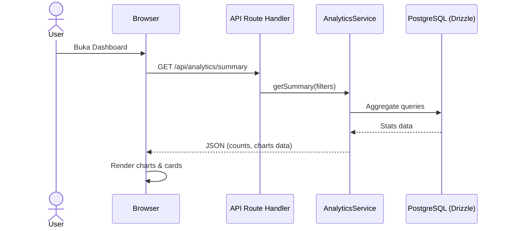
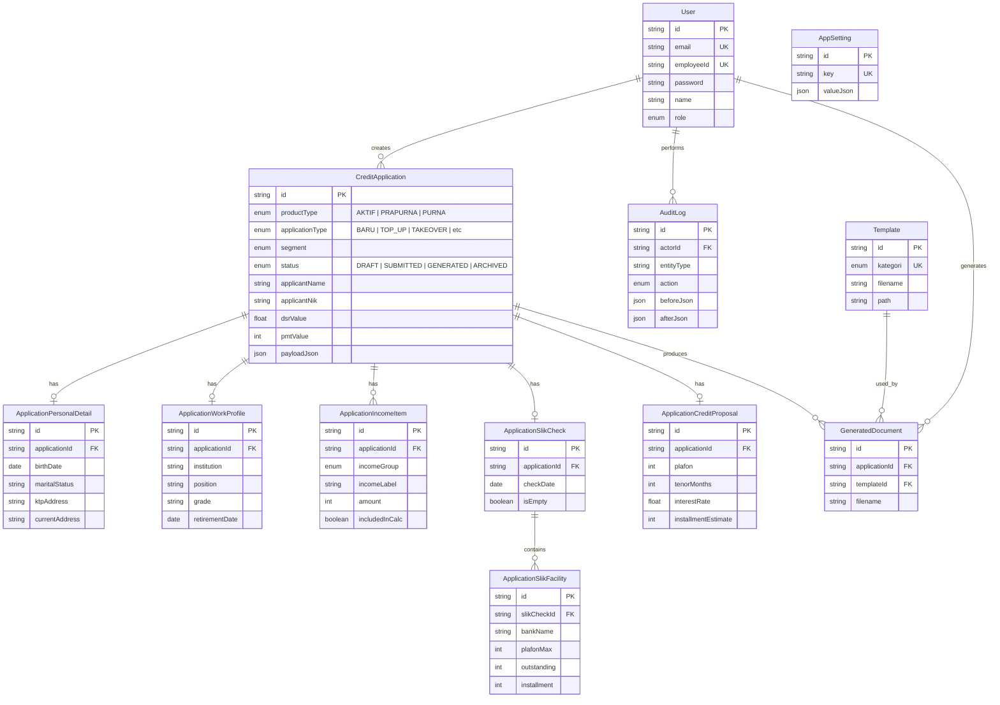

# 📋 PRD — Aplikasi Kredit Konsumer BNI (Web Full Stack)

> **Versi:** 2.0 (Redesign — Iterasi)  
> **Tanggal:** 4 Mei 2026  
> **Status:** ✅ FINAL  
> **Pendekatan:** Iterasi di atas codebase existing

---

## 1. Overview

### 1.1 Latar Belakang

Aplikasi Kredit Konsumer BNI adalah sistem internal berbasis web untuk memproses pengajuan kredit pensiun dan kredit aktif pada produk **BNI Fleksi** (Fleksi Purna, Fleksi Prapurna, dan Fleksi Aktif). Aplikasi menangani seluruh lifecycle pengajuan — dari input data debitur, validasi kelayakan (DSR/RPC), hingga generate dokumen investigasi (.docx) otomatis.

### 1.2 Scope Redesign (v2.0)

Redesign ini bersifat **iterasi** di atas codebase existing, dengan perubahan utama:

| Area | Dari (v1.x) | Ke (v2.0) |
|------|-------------|-----------|
| **ORM** | Prisma | Drizzle ORM |
| **Auth** | NextAuth.js v4 | Better Auth |
| **UI Components** | Custom components | shadcn/ui |
| **Legacy Model** | Debitur (JSON blob) co-exist | Deprecated → CreditApplication only |
| **Dashboard** | Statistik sederhana | Analytics & reporting |
| **Deployment Plan** | Portable only | Portable + Vercel (future) |

### 1.3 Tujuan

1. Mempercepat proses input dan validasi data pengajuan kredit konsumer
2. Mengotomatisasi perhitungan kelayakan kredit (PMT, DSR, RPC)
3. Menghasilkan dokumen investigasi (.docx) otomatis dari template
4. Menyediakan riwayat, pencarian, dan **reporting/analytics** data debitur
5. Mendukung deployment portable (saat ini) dan **multi-user server-based** (roadmap)

### 1.4 Produk Kredit

| Produk | Deskripsi | Segmentasi |
|--------|-----------|------------|
| **Fleksi Prapurna** | Kredit PNS/pegawai menjelang pensiun | Taspen, Asabri |
| **Fleksi Purna** | Kredit pensiunan aktif | Taspen, Asabri |
| **Fleksi Aktif** | Kredit pegawai aktif | BUMD/BUMN, Swasta, Pemerintahan |

### 1.5 Jenis Pengajuan

Baru, Top Up, Top Up Sisa Gaji, Take Over, THT (Prapurna), Fleksi Aktif

### 1.6 Target Pengguna

| Role | Deskripsi |
|------|-----------|
| **USER** | Analis kredit yang input data debitur dan generate dokumen |
| **ADMIN** | Supervisor yang kelola user, template, dan konfigurasi |

---

## 2. Requirements

### 2.1 Functional Requirements

| ID | Requirement | Prioritas |
|----|------------|-----------|
| FR-01 | Autentikasi login dengan Better Auth (role ADMIN/USER) | P0 |
| FR-02 | Form input multi-tab (Identitas, Pekerjaan, Penghasilan, SLIK, Usulan) | P0 |
| FR-03 | Perhitungan PMT otomatis real-time | P0 |
| FR-04 | Validasi DSR ≤ 90% sebagai hard block | P0 |
| FR-05 | Generate dokumen .docx otomatis dari template | P0 |
| FR-06 | Riwayat debitur dengan filter & pencarian | P0 |
| FR-07 | Edit data debitur tersimpan | P0 |
| FR-08 | Download dokumen yang sudah di-generate | P0 |
| FR-09 | **Dashboard analytics & reporting** | P1 |
| FR-10 | Manajemen template dokumen (Admin) | P1 |
| FR-11 | Perhitungan biaya otomatis (Provisi, Tatalaksana, PSJT, Admin) | P1 |
| FR-12 | Konfigurasi instansi-specific | P1 |
| FR-13 | Preview data sebelum simpan | P1 |
| FR-14 | Audit trail | P1 |
| FR-15 | **Migrasi data Debitur → CreditApplication** | P1 |
| FR-16 | App settings (Admin) | P2 |
| FR-17 | Idle timeout / auto-logout | P2 |

### 2.2 Non-Functional Requirements

| ID | Requirement | Target |
|----|------------|--------|
| NFR-01 | Portable tanpa install (saat ini) | Windows 10/11 |
| NFR-02 | Offline setelah setup awal | 100% |
| NFR-03 | Response time < 2 detik (CRUD) | P95 |
| NFR-04 | Generate dokumen < 5 detik | Per dokumen |
| NFR-05 | Dark mode support | Toggle |
| NFR-06 | Database backup/restore | Script-based |
| NFR-07 | **Siap multi-user deployment** (roadmap) | Vercel + managed DB |

---

## 3. Core Features

### 3.1 Autentikasi & Otorisasi (Better Auth)
- Login email + password via Better Auth
- Role-based access: ADMIN, USER
- Middleware protection semua route
- Session management
- Idle timeout auto-logout

### 3.2 Manajemen Debitur (Multi-Tab Form)

**Tab A — Identitas:** Nama, NIK, tanggal lahir, alamat KTP/tinggal, status perkawinan, status rumah, data kerabat (Purna)

**Tab B — Pekerjaan/Pensiun:**
- *Aktif:* Segmentasi, instansi, jabatan, golongan, SK, masa kerja, data verifikator
- *Purna:* NOPEN, SK pensiun, TMT pensiun
- *Prapurna:* Gabungan aktif + estimasi pensiun

**Tab C — Penghasilan:**
- *Aktif:* Gaji 3 bulan (variance calculation), tunjangan dinamis, payroll
- *Purna:* Pensiun 3 bulan (mode minimum/langsung)
- *Prapurna:* Estimasi hak pensiun, THT, blokiran

**Tab D — SLIK:** Fasilitas kredit eksisting multi-entry (bank, plafon, outstanding, angsuran, kolektibilitas, flag takeover/topup)

**Tab E — Usulan Kredit:** Plafon, tenor, bunga, angsuran (auto PMT), tujuan kredit, biaya-biaya, syarat penandatanganan/pencairan

### 3.3 Kalkulator Kredit Real-time
- **PMT**: Angsuran bulanan otomatis
- **DSR**: Total angsuran / Penghasilan × 100% — **Hard block jika > 90%**
- **Variance**: Selisih gaji > 20% → gunakan minimum; ≤ 20% → rata-rata
- **DSC 90%** dan **Maksimal Angsuran** otomatis

### 3.4 Generate Dokumen Otomatis
- Template-based: `docxtemplater` + `PizZip`
- Template per kategori (Prapurna, Purna, Aktif)
- List investigasi dinamis per segmentasi
- Konfigurasi instansi-specific (PLN, Kejaksaan, UNG, dll.)

### 3.5 Riwayat & Pencarian
- Tabel debitur dengan pagination
- Filter: nama, NIK, jenis pengajuan, segmentasi, produk
- Aksi: Download, Edit, Detail
- Status: DRAFT → SUBMITTED → GENERATED → ARCHIVED

### 3.6 Dashboard Analytics & Reporting (🆕)
- Jumlah pengajuan per bulan (chart)
- Total plafon yang disalurkan
- Distribusi DSR (histogram/gauge)
- Breakdown per produk dan segmentasi
- Statistik status pengajuan

### 3.7 Admin Panel
- Manajemen template dokumen
- App settings
- Audit log viewer

### 3.8 Migrasi Data Legacy (🆕)
- Deprecate model `Debitur` secara bertahap
- Backfill data dari `Debitur.dataLengkap` (JSON) → `CreditApplication` (normalized)
- Semua fitur baru hanya menggunakan `CreditApplication`

---

## 4. User Flow

### 4.1 Flow Utama — Input & Generate



### 4.2 Flow Riwayat



### 4.3 Flow Admin



---

## 5. Architecture

### 5.1 High-Level Architecture

```
┌──────────────────────────────────────────────────────┐
│                  CLIENT (Browser)                     │
│           React 19 + TailwindCSS 4 + shadcn/ui       │
│   ┌────────┬──────────┬─────────┬─────────┬───────┐  │
│   │ Login  │Dashboard │  Forms  │Riwayat  │ Admin │  │
│   │        │Analytics │MultiTab │         │       │  │
│   └────────┴──────────┴─────────┴─────────┴───────┘  │
│         Zustand Store  |  Custom Hooks                │
└───────────────────────┬──────────────────────────────┘
                        │ HTTP (fetch)
┌───────────────────────▼──────────────────────────────┐
│            NEXT.JS APP ROUTER (Server)                │
│  ┌───────────────────────────────────────────────┐   │
│  │          API Route Handlers (/api/*)           │   │
│  │  auth | applications | templates | settings   │   │
│  │  analytics | calculate | health               │   │
│  └──────────────────────┬────────────────────────┘   │
│  ┌──────────────────────▼────────────────────────┐   │
│  │         Backend Services Layer                 │   │
│  │  ApplicationService | DocumentService         │   │
│  │  TemplateService | CalculationService         │   │
│  │  AuditService | ConfigService                 │   │
│  │  AnalyticsService (🆕)                        │   │
│  └──────────────────────┬────────────────────────┘   │
│  ┌──────────────────────▼────────────────────────┐   │
│  │       Document Generation Engine               │   │
│  │  ListGenerators | TemplateContext              │   │
│  │  AliasMapper | InstansiConfig | Formatters     │   │
│  │  docxtemplater + PizZip                        │   │
│  └───────────────────────────────────────────────┘   │
│  ┌───────────────────────────────────────────────┐   │
│  │     Drizzle ORM (🆕 replacing Prisma)         │   │
│  └──────────────────────┬────────────────────────┘   │
│  ┌──────────────────────▼────────────────────────┐   │
│  │           Better Auth (🆕 replacing NextAuth)  │   │
│  └───────────────────────────────────────────────┘   │
└───────────────────────┬──────────────────────────────┘
                        │
┌───────────────────────▼──────────────────────────────┐
│          PostgreSQL 15 (Database)                     │
│  Portable (saat ini) → Managed DB (roadmap Vercel)   │
└──────────────────────────────────────────────────────┘
```

### 5.2 Folder Structure (Target v2.0)

```
frontend/src/
├── app/
│   ├── (auth)/login/
│   ├── (dashboard)/
│   │   ├── page.tsx                    # Dashboard + Analytics (🆕)
│   │   ├── admin/template/
│   │   ├── debitur/
│   │   ├── form/{aktif,prapurna,purna}/
│   │   └── settings/
│   └── api/                            # API Route Handlers
│       ├── auth/                       # Better Auth handlers (🆕)
│       ├── applications/
│       ├── analytics/                  # Analytics endpoints (🆕)
│       ├── calculate/
│       ├── settings/
│       └── template(s)/
├── backend/
│   ├── db/                             # Drizzle schema & config (🆕)
│   │   ├── schema.ts
│   │   ├── index.ts
│   │   └── migrations/
│   ├── auth/                           # Better Auth config (🆕)
│   └── services/
│       ├── document/                   # Document generation engine
│       └── *.service.ts
├── components/
│   ├── ui/                             # shadcn/ui components (🆕)
│   ├── forms/
│   ├── layout/
│   └── providers/
├── hooks/
├── lib/
├── stores/                             # Zustand
├── types/
└── constants/
```

---

## 6. Sequence Diagram

### 6.1 Input & Simpan Debitur Baru



### 6.2 Generate & Download Dokumen



### 6.3 Dashboard Analytics



---

## 7. Database Schema

### 7.1 ERD (Model Utama — CreditApplication)



### 7.2 Migrasi Model Legacy

| Tabel | Status v2.0 | Tindakan |
|-------|-------------|----------|
| `debiturs` | **DEPRECATED** | Data di-backfill ke `credit_applications`, tabel dipertahankan sebagai read-only, dihapus di v3.0 |
| `credit_applications` + related tables | **PRIMARY** | Semua fitur baru menggunakan model ini |

> [!NOTE]
> Schema akan di-reimplementasi menggunakan **Drizzle ORM** (TypeScript schema definition). Struktur tabel tetap sama, hanya cara definisi yang berubah dari Prisma schema ke Drizzle schema.

---

## 8. Design & Technical Constraints

### 8.1 Business Rules

| # | Rule |
|---|------|
| 1 | **DSR Hard Block**: DSR > 90% → data TIDAK boleh disimpan |
| 2 | **Variance Rule**: Selisih gaji > 20% → gunakan minimum; ≤ 20% → rata-rata |
| 3 | **Template per Kategori**: Setiap produk punya template .docx terpisah |
| 4 | **Segmentasi-specific output**: List investigasi berbeda per segmentasi |
| 5 | **Instansi-specific config**: Teks hardcoded untuk instansi tertentu |

### 8.2 Technical Constraints

| # | Constraint |
|---|-----------|
| 1 | Portable deployment (Node.js + PostgreSQL di `tools/`) — saat ini |
| 2 | Offline-capable setelah npm install pertama |
| 3 | Windows 10/11 (64-bit) sebagai target utama |
| 4 | Template .docx menggunakan placeholder `docxtemplater` |
| 5 | **Roadmap**: Vercel deployment + managed PostgreSQL untuk multi-user |

### 8.3 UI/UX Constraints

| # | Constraint |
|---|-----------|
| 1 | Tema warna BNI (oranye sebagai primary) |
| 2 | Dark mode support |
| 3 | **shadcn/ui** sebagai component library |
| 4 | Responsive sidebar (collapsible) |
| 5 | Form multi-tab dengan navigasi |
| 6 | Real-time calculation feedback |
| 7 | Dashboard charts untuk analytics |

---

## 9. Tech Stack

### 9.1 Stack v2.0 (Target)

| Layer | Teknologi | Catatan |
|-------|-----------|---------|
| **Framework** | Next.js (App Router) | Dipertahankan |
| **Runtime** | React 19 | Dipertahankan |
| **Language** | TypeScript 5.x | Dipertahankan |
| **UI Components** | **shadcn/ui** | 🆕 Menggantikan custom components |
| **Styling** | TailwindCSS 4.x | Dipertahankan |
| **Auth** | **Better Auth** | 🆕 Menggantikan NextAuth.js |
| **ORM** | **Drizzle ORM** | 🆕 Menggantikan Prisma |
| **Database** | PostgreSQL 15 | Dipertahankan |
| **State Management** | Zustand 5.x | Dipertahankan |
| **Validation** | Zod 4.x | Dipertahankan |
| **Document Gen** | docxtemplater + PizZip | Dipertahankan |
| **Icons** | Lucide React | Dipertahankan (built-in shadcn) |
| **Password** | bcryptjs | Dipertahankan |
| **Charts** | Recharts (via shadcn/ui charts) | 🆕 Untuk analytics |

### 9.2 Alasan Perubahan Stack

| Perubahan | Alasan |
|-----------|--------|
| Prisma → **Drizzle** | Lebih ringan, type-safe, SQL-like API, bundle size kecil, cocok untuk edge/serverless |
| NextAuth → **Better Auth** | Framework-agnostic, lebih fleksibel, built-in session management, easier customization |
| Custom UI → **shadcn/ui** | Accessible, themeable, consistent design system, copy-paste components, built on Radix UI |

### 9.3 Deployment Strategy

| Phase | Mode | Detail |
|-------|------|--------|
| **Sekarang** | Portable | Node.js + PostgreSQL di `tools/`, `run-app.bat` |
| **Roadmap** | Vercel + Managed DB | Next.js on Vercel, PostgreSQL on Neon/Supabase, multi-user |

---

## Roadmap Migrasi

### Phase 1 — Foundation (Prioritas Tinggi)
- [ ] Setup Drizzle ORM + migrasi schema dari Prisma
- [ ] Setup Better Auth (replace NextAuth.js)
- [ ] Install & konfigurasi shadcn/ui
- [ ] Migrasi UI components ke shadcn/ui

### Phase 2 — Feature Parity
- [ ] Migrasi semua API routes ke Drizzle queries
- [ ] Migrasi auth middleware ke Better Auth
- [ ] Pastikan semua fitur existing berfungsi sama

### Phase 3 — New Features
- [ ] Dashboard analytics & reporting
- [ ] Backfill data Debitur → CreditApplication
- [ ] Deprecate model Debitur (read-only)

### Phase 4 — Deployment (Roadmap)
- [ ] Setup Vercel deployment
- [ ] Migrasi PostgreSQL ke managed service
- [ ] Multi-user support & access control
